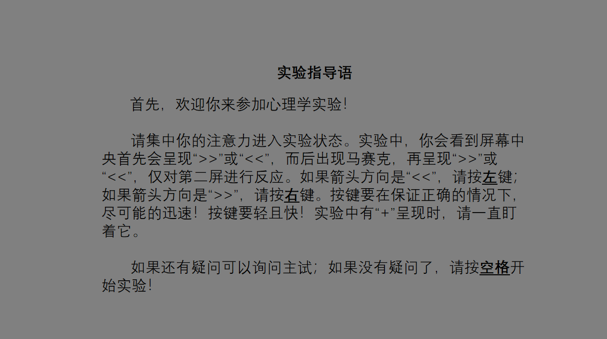

# 负启动心理测试
## Install
使用conda创建虚拟环境，并安装psychopy
```shell script
conda create -n env_name python=3.6
conda acticate env_name
conda install psychopy
pip install pygame
```

## Run
run following codes in the env ***env_name*** crearted before
```shell script
python main.py
```

## Result
实验具体记录在data文件中的csv中，result.csv是实验记录的简单统计

